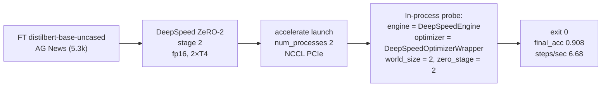

# DeepSpeed ZeRO-2 on 2×T4 — verified working

A single, self-contained Kaggle notebook that fine-tunes **`distilbert-base-uncased` on AG News**
with **DeepSpeed ZeRO-2**, on a **2×NVIDIA T4 (15 GB) GPU pair**, and
**proves from the process itself that ZeRO-2 is actually active**.

Ran to completion on 2×T4 (sm_75, fp16). Observed on that run:
`final_acc:0.908`, `steps/sec:6.68`, `train_runtime:44.06s`.

> The exact numbers vary per machine / run — these are the values from the 2×T4 run
> saved in this repo.

---

## 1. What this verifies



ZeRO-2 is ZeRO-1 (sharded **optimizer states**) plus sharded **gradients**. That lets
larger models fit in the same memory budget. For a small model like DistilBERT the memory
saving is not dramatic — the value is a correct, proven ZeRO substrate to advance to
ZeRO-3 and to larger models.

### ZeRO stages

| Stage | Sharded across ranks |
|---|---|
| 0 | (none — plain DDP) |
| 1 | optimizer states |
| **2 (this notebook)** | optimizer states **and** gradients |
| 3 | optimizer states + gradients **and** parameters |

---

## 2. Files

| File | Purpose |
|---|---|
| `deepspeed-zero-2-on-2xt4-distilbert-ag-news.ipynb` | The notebook. Create the DeepSpeed config in the cell and launch. |

The notebook generates, in-Kaggle, two helper files on each run:

| File (generated in-Kaggle) | Role |
|---|---|
| `ds_zero2.json` | DeepSpeed config: `stage:2`, fp16, `train_batch_size:64`, `micro_batch:32`, `grad_acc:1` |
| `train_ds_zero2.py` | Trainer script: `datasets`, `transformers.Trainer` (full-parameter FT), in-process ZeRO probe, eval, metrics |

---

## 3. How to reproduce (Kaggle)

1. **Setups** tab → **2× NVIDIA T4 (15 GB)**. GPU mode on.
2. Import the notebook (it is self-contained — the cell builds the config and the trainer, writes them to disk, then launches).
3. Run all cells.

Expected final block (from the 2×T4 run saved in this repo; the two `[rank …]`
lines are interleaved on one physical stdout line in the real output and are shown
on separate lines here for readability):

```
[rank 0 / world 2]
[rank 1 / world 2]
[check] deepspeed_enabled=True  v=0.19.6
{'loss': 0.8844, 'grad_norm': 1.8586761951446533, 'learning_rate': 1.686666666666667e-05, 'epoch': 0.53}
{'loss': 0.3716, 'grad_norm': 2.2548937797546387, 'learning_rate': 1.3533333333333333e-05, 'epoch': 1.06}
{'loss': 0.3113, 'grad_norm': 3.1397860050201416, 'learning_rate': 1.02e-05, 'epoch': 1.6}
{'loss': 0.2645, 'grad_norm': 2.687011957168579, 'learning_rate': 6.866666666666667e-06, 'epoch': 2.13}
{'loss': 0.2388, 'grad_norm': 2.0090646743774414, 'learning_rate': 3.5333333333333335e-06, 'epoch': 2.66}
{'loss': 0.2234, 'grad_norm': 2.3729889392852783, 'learning_rate': 2.0000000000000002e-07, 'epoch': 3.19}
{'train_runtime': 44.055, 'train_samples_per_second': 435.819, 'train_steps_per_second': 6.81, 'train_loss': 0.38233734130859376, 'epoch': 3.19}
[proof] engine=DeepSpeedEngine  is_DeepSpeedEngine=True  is_DDP=False
[proof] optimizer=DeepSpeedOptimizerWrapper
{'world_size': '2', 'zero_stage': 2, 'engine_cls': 'DeepSpeedEngine', 'optimizer_cls': 'DeepSpeedOptimizerWrapper', 'steps/sec': 6.68, 'final_acc': 0.908}
[result] {'world_size': '2', 'zero_stage': 2, 'engine_cls': 'DeepSpeedEngine', 'optimizer_cls': 'DeepSpeedOptimizerWrapper', 'steps/sec': 6.68, 'final_acc': 0.908}
```

Both ranks printed the same `[proof]` lines and the same final summary dict.
The summary dict is also written to `out_zero2/metrics.json`.

---

## 4. What the proof block does

After `trainer.train()` returns, the trainer (still inside the ranked process) inspects
the objects that `Trainer` actually built — not a hard-coded assumption:

1. Reads `trainer.model_wrapped` and prints its class — `DeepSpeedEngine`.
2. `isinstance(trainer.model_wrapped, deepspeed.DeepSpeedEngine)` → `True`
   (printed as `is_DeepSpeedEngine=True`).
3. `'DistributedDataParallel' in type(...).__name__` → `False` (printed as `is_DDP=False`)
   — i.e., it is a DeepSpeed engine, not plain DDP.
4. Prints `type(trainer.optimizer).__name__` → `DeepSpeedOptimizerWrapper`
   (ZeRO-1 and ZeRO-2 both use `DeepSpeedOptimizer` for non-offload configs — expected).
5. The summary dict reads the **actual** `zero_optimization.stage` from the JSON file that
   was launched (`json.load(...).get("zero_optimization", {}).get("stage")`) → `2`, so the
   stage is evidence, not a constant.

If any of those were wrong you would see mismatched class names in the printout.

---

## 5. Local reproduction (non-Kaggle, 2×GPU)

The notebook writes `ds_zero2.json` and `train_ds_zero2.py` to the working dir, then runs:

```bash
pip install deepspeed "transformers>=4.57" datasets accelerate
# (run from the dir where ds_zero2.json and train_ds_zero2.py were written)
accelerate launch --num_processes 2 --mixed_precision fp16 \
  train_ds_zero2.py \
  --out_dir out_zero2 \
  --per_device_train_bs 32 \
  --steps 300 \
  --ds_config ds_zero2.json
```

Do **not** use `deepspeed --num_gpus 2 train_ds_zero2.py` here — the trainer passes the
`ds_zero2.json` path to `TrainingArguments(deepspeed=...)` and builds DeepSpeed inside
`Trainer.train()`. That is the `accelerate`/`Trainer` path, not the DeepSpeed CLI launcher.

---

## 6. Tuning knobs (all in `ds_zero2.json`)

The minimal config this notebook writes:

| Key | Value in notebook | Meaning |
|---|---|---|
| `zero_optimization.stage` | `2` | The ZeRO stage. `1`/`3` to switch. |
| `train_micro_batch_size_per_gpu` | `32` | Per-device batch. |
| `train_batch_size` | `64` | Global batch (= 32 × 2 ranks × 1 grad-acc). |
| `gradient_accumulation_steps` | `1` | Steps to accumulate before an optimizer update. |
| `fp16.enabled` | `true` | T4 is sm_75 (fp16). For A100/A10 use `bf16` instead. |

> `ds_zero2.json` is kept intentionally minimal. DeepSpeed applies its own sensible
> defaults for `overlap_comm`, `contiguous_gradients`, and bucket sizes at `stage:2`;
> add those keys only if you need to tune them.

---

## 7. Upgrade path

## 7. Upgrade path

- **→ ZeRO-3:** change `zero_optimization.stage` to `3`. Optionally add
  `zero_optimization.stage3_prefetch_bucket_size` and `zero_optimization.stage3_param_persistence_threshold`
  if you tune memory. ZeRO-3 shards parameters across ranks, which is where it pays off for
  larger models.
- **→ Bigger models:** ZeRO-2 gives you headroom for ~2–3× model sizes vs ZeRO-1. ZeRO-3 for
  larger.
- **→ BF16:** swap `fp16` for `bf16` on Ampere+ GPUs (T4 needs fp16; it has no bf16 HW).
- **→ LoRA / QLoRA:** the current notebook does full-parameter fine-tuning. To add PEFT,
  install `peft`, wrap the model with `LoraConfig` + `get_peft_model`, and the ZeRO config
  stays the same.

---

## 8. Non-fatal warnings you may see (all safe to ignore)

| Warning | Why it's not a problem |
|---|---|
| `collect2: ld: fatal: temporary file: cannot open: No such file or directory` | DeepSpeed JIT-compile noise (C++ launcher), not a failure. |
| `deepspeed 0.19.6` warnings about deprecated `NCCL_ASYNC_ERROR_HANDLING` | Harmless, from the installed NCCL env var. |
| `tokenizer` kwarg deprecated in `transformers 4.57` | Harmless deprecation. |
| `WORLD_SIZE`, `RANK` env warnings in logs | Expected under `accelerate launch`. |

None of these affect the `exit 0` + `final_acc` outcomes.

## 9. License

Kaggle notebook is CC-BY-NC 4.0 by default. Model weights (`distilbert-base-uncased`) are MIT.
LoRA weights are yours.
