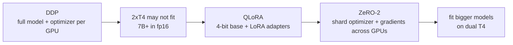

# Kaggle 2×T4 QLoRA + ZeRO-2 SFT Fine-tuning

Fine-tune a small chat model (**Qwen-1.8B-Chat-Int4**, GPTQ 4-bit) on Kaggle's free **2×T4 GPUs** using **QLoRA + ZeRO-2** multi-GPU supervised fine-tuning (SFT).

> **Status**: setup complete, run pending on Kaggle dual-T4. Results are not verified yet — this is a work in progress reproduction.

---

## What this is

Extends the DDP foundation to **large-model fine-tuning** on free dual-T4:

| Aspect | Value |
|---|---|
| Method | **QLoRA** (4-bit quantized LoRA) + **ZeRO-2** (optimizer/gradient sharding) |
| Model | `Qwen/Qwen-1_8B-Chat-Int4` |
| Multi-GPU | `torchrun --nproc_per_node 2` (DDP) |
| Engine | Qwen official `finetune.py` (HF-native `from_pretrained`) |
| ZeRO config | `ds_config_zero2.json` (`zero_optimization.stage=2`, no CPU offload) |
| Precision | bf16 + gradient checkpointing |

---

## File layout

| File | Description |
|---|---|
| `qwen_qlora_zero2_sft.ipynb` | Kaggle notebook: install deps → verify GPUs → download data → `torchrun` ZeRO-2 QLoRA train |
| `finetune.py` | Qwen training engine (adapted from public code, see Credits) |
| `ds_config_zero2.json` | DeepSpeed ZeRO-2 config |
| `LICENSE` | Apache-2.0 |

---

## How to run (Kaggle)

1. New Kaggle notebook → Settings → Accelerator = **GPU T4 x2**.
2. Put `finetune.py` and `ds_config_zero2.json` in the same working directory as the notebook (the `torchrun` cell references `./finetune.py`).
3. Run the notebook. The training data is downloaded automatically (Aliyun OSS URL); the Int4 model is pulled from Hugging Face Hub.

Expected on dual T4: `world_size=2`, DeepSpeed ZeRO-2 stage initialized, QLoRA training starts.

---

## Why ZeRO-2 (and not just DDP)

- **DDP** duplicates the model + optimizer state on every GPU.
- **QLoRA** freezes the 4-bit base model and only trains tiny LoRA adapters → huge memory cut.
- **ZeRO-2** shards the optimizer state and gradients across the two GPUs → even more headroom.

---

## Credits & License

`finetune.py` is the Qwen official training engine:

- **Repo**: https://github.com/QwenLM/Qwen (`recipes/finetune/deepspeed/finetune_qlora_multi_gpu.ipynb` + `finetune/ds_config_zero2.json`)
- Derivation: Qwen's `finetune.py` header states it is *based on revised code from FastChat based on tatsu-lab/stanford_alpaca*.
- All three upstream projects (Qwen, FastChat, Stanford-Alpaca) are **Apache-2.0** (verified via GitHub API).
- Modifications here: model/data download switched from **ModelScope → Hugging Face Hub**; the training engine and ZeRO config are unchanged.
- The notebook also runs under Kaggle with `accelerator: GPU T4 x2`.

This repository is licensed under Apache-2.0 (see `LICENSE`).
