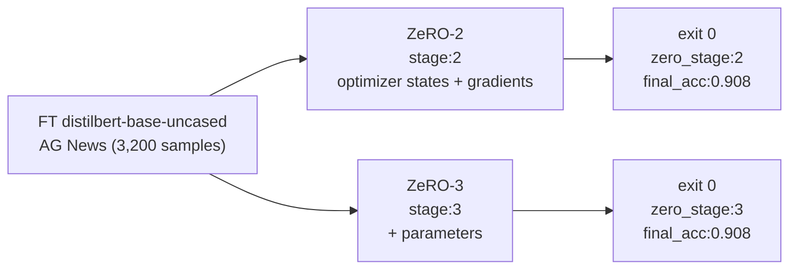

# DeepSpeed ZeRO-2 & ZeRO-3 on 2×T4 — both verified

Two self-contained Kaggle notebooks, one per stage, that fine-tune **`distilbert-base-uncased` on AG News** and
**prove — from the process itself — that the ZeRO stage actually ran**.

| Stage | Notebook | Verified `zero_stage` | Verified `final_acc` | `steps/sec` | `train_runtime` |
|:--|:--|:--|:--|:--|:--|
| **ZeRO-2** | `deepspeed-zero-2-on-2xt4-distilbert-ag-news.ipynb` | `2` | `0.908` | `6.68` | `44.06 s` |
| **ZeRO-3** | `deepspeed-zero-3-on-2xt4-distilbert-ag-news.ipynb` | `3` | `0.908` | `4.96` | `57.34 s` |

Both runs: `exit 0`, `world_size:2`, `engine_cls: DeepSpeedEngine`, `optimizer_cls: DeepSpeedOptimizerWrapper`,
`is_DeepSpeedEngine=True`, `is_DDP=False` on **both** ranks. DeepSpeed `0.19.6`. Hardware: `2×NVIDIA T4 (sm_75, fp16)`.

> Numbers below are the observed, verbatim values from the two 2×T4 runs saved in this repo.

---

## 1. What each notebook proves



Both notebooks share the same trainer / proof block / launch command. The **only** differences between the two
are the DeepSpeed config's `zero_optimization.stage` and the per-stage filenames:

| Item | ZeRO-2 | ZeRO-3 |
|:--|:--|:--|
| DeepSpeed config file | `ds_zero2.json` | `ds_zero3.json` |
| `zero_optimization.stage` | `2` | `3` |
| Trainer script | `train_ds_zero2.py` | `train_ds_zero3.py` |
| `output_dir` | `out_zero2/` | `out_zero3/` |

The trainer logic, proof block, and `accelerate launch` command are otherwise identical.

### ZeRO stage reference

| Stage | Sharded across ranks |
|:--|:--|
| 0 | (none — plain DDP) |
| 1 | optimizer states |
| **2** | optimizer states **and** gradients |
| **3** | optimizer states + gradients **and** parameters |

---

## 2. Files

| File | Purpose |
|:--|:--|
| `deepspeed-zero-2-on-2xt4-distilbert-ag-news.ipynb` | Verified ZeRO-2 notebook (Kaggle 2×T4, `final_acc 0.908`). |
| `deepspeed-zero-3-on-2xt4-distilbert-ag-news.ipynb` | Verified ZeRO-3 notebook (Kaggle 2×T4, `final_acc 0.908`). |

Each notebook generates, in-Kaggle, two helper files per run:

| File (generated in-Kaggle) | Role (ZeRO-2 shown; ZeRO-3 is identical with stage changed) |
|:--|:--|
| `ds_zero2.json` / `ds_zero3.json` | DeepSpeed config: `stage:2` / `stage:3`, `fp16`, `train_batch_size:64`, `train_micro_batch_size_per_gpu:32`, `gradient_accumulation_steps:1` |
| `train_ds_zero2.py` / `train_ds_zero3.py` | Trainer script: `datasets`, `transformers.Trainer` (full-parameter FT), in-process ZeRO probe, eval, metrics |

---

## 3. Observed output (verbatim)

### ZeRO-2 run

```
[rank 0 / world 2]
[rank 1 / world 2]
[check] deepspeed_enabled=True  v=0.19.6
{'loss': 0.8844, 'grad_norm': 1.8586761951446533, 'learning_rate': 1.686666666666667e-05, 'epoch': 0.53}
{'loss': 0.3716, 'grad_norm': 2.2548937797546387, 'learning_rate': 1.3533333333333333e-05, 'epoch': 1.06}
{'loss': 0.3113, 'grad_norm': 3.1397860050201416, 'learning_rate': 1.02e-05, 'epoch': 1.6}
{'loss': 0.2645, 'grad_norm': 2.687011957168579, 'learning_rate': 6.866666666666667e-06, 'epoch': 2.13}
{'loss': 0.2388, 'grad_norm': 2.0090646743774414, 'learning_rate': 3.5333333333333335e-06, 'epoch': 2.66}
{'loss': 0.2234, 'grad_norm': 2.3729889392852783, 'learning_rate': 2.0000000000000002e-07, 'epoch': 3.19}
{'train_runtime': 44.055, 'train_samples_per_second': 435.819, 'train_steps_per_second': 6.81, 'train_loss': 0.38233734130859376, 'epoch': 3.19}
[proof] engine=DeepSpeedEngine  is_DeepSpeedEngine=True  is_DDP=False
[proof] optimizer=DeepSpeedOptimizerWrapper
{'world_size': '2', 'zero_stage': 2, 'engine_cls': 'DeepSpeedEngine', 'optimizer_cls': 'DeepSpeedOptimizerWrapper', 'steps/sec': 6.68, 'final_acc': 0.908}
[exit code]: 0
```

### ZeRO-3 run

```
[rank 0 / world 2]
[rank 1 / world 2]
[check] deepspeed_enabled=True  v=0.19.6
{'loss': 0.8844, 'grad_norm': 1.8600805965622136, 'learning_rate': 1.686666666666667e-05, 'epoch': 0.53}
{'loss': 0.3716, 'grad_norm': 2.2620520020900248, 'learning_rate': 1.3533333333333333e-05, 'epoch': 1.06}
{'loss': 0.3114, 'grad_norm': 3.1428825690251676, 'learning_rate': 1.02e-05, 'epoch': 1.6}
{'loss': 0.2646, 'grad_norm': 2.6882827440253916, 'learning_rate': 6.866666666666667e-06, 'epoch': 2.13}
{'loss': 0.2388, 'grad_norm': 2.008491183980884, 'learning_rate': 3.5333333333333335e-06, 'epoch': 2.66}
{'loss': 0.2234, 'grad_norm': 2.3611863588012403, 'learning_rate': 2.0000000000000002e-07, 'epoch': 3.19}
{'train_runtime': 57.3377, 'train_samples_per_second': 334.858, 'train_steps_per_second': 5.232, 'train_loss': 0.38235997517903647, 'epoch': 3.19}
[proof] engine=DeepSpeedEngine  is_DeepSpeedEngine=True  is_DDP=False
[proof] optimizer=DeepSpeedOptimizerWrapper
{'world_size': '2', 'zero_stage': 3, 'engine_cls': 'DeepSpeedEngine', 'optimizer_cls': 'DeepSpeedOptimizerWrapper', 'steps/sec': 4.96, 'final_acc': 0.908}
[exit code]: 0
```

Both ranks print the same `[proof]` lines and the same final summary dict on each run.
The summary dict is also written to `out_zero2/metrics.json` (ZeRO-2) or `out_zero3/metrics.json` (ZeRO-3).

---

## 4. What the proof block does

After `trainer.train()` returns, the trainer (still inside the ranked process) inspects the objects that
`Trainer` actually built — not a hard-coded assumption:

| # | Check | Both ZeRO-2 and ZeRO-3 |
|:--|:--|:--|
| 1 | `type(trainer.model_wrapped).__name__` | `DeepSpeedEngine` |
| 2 | `isinstance(trainer.model_wrapped, deepspeed.DeepSpeedEngine)` | `True` |
| 3 | `'DistributedDataParallel' in type(...).__name__` | `False` |
| 4 | `type(trainer.optimizer).__name__` | `DeepSpeedOptimizerWrapper` |
| 5 | Read back `json.load(ds_zeroN.json)["zero_optimization"]["stage"]` | `2` (Z2) / `3` (Z3) — **evidence, not a constant** |

If any of those were wrong you would see mismatched class names in the printout.

---

## 5. Reproduce (Kaggle)

1. **Setup** tab → **2× NVIDIA T4 (15 GB)**, GPU on, **Internet on**.
2. Import the notebook of the stage you want.
3. **Run all**. Expect `exit 0` and the summary line above.

---

## 6. Reproduce (local, 2×GPU, non-Kaggle)

```bash
pip install deepspeed "transformers>=4.57" datasets accelerate

# ZeRO-2
accelerate launch --num_processes 2 --mixed_precision fp16 \
  train_ds_zero2.py --out_dir out_zero2 --per_device_train_bs 32 --steps 300 --ds_config ds_zero2.json

# ZeRO-3
accelerate launch --num_processes 2 --mixed_precision fp16 \
  train_ds_zero3.py --out_dir out_zero3 --per_device_train_bs 32 --steps 300 --ds_config ds_zero3.json
```

Do **not** use `deepspeed --num_gpus 2 …` here — the trainer passes the config path to
`TrainingArguments(deepspeed=...)` and builds DeepSpeed inside `Trainer.train()`. That is the `accelerate`/`Trainer`
path, not the DeepSpeed CLI launcher.

---

## 7. Tuning knobs (all in `ds_zeroN.json`)

| Key | Value in notebook | Meaning |
|:--|:--|:--|
| `zero_optimization.stage` | `2` or `3` | The ZeRO stage. |
| `train_micro_batch_size_per_gpu` | `32` | Per-device batch. |
| `train_batch_size` | `64` | Global batch (32 × 2 ranks × 1 grad-acc). |
| `gradient_accumulation_steps` | `1` | Steps to accumulate before an optimizer update. |
| `fp16.enabled` | `true` | T4 is `sm_75` (fp16). On A100/A10/L4 you can switch to `bf16`. |

`ds_zeroN.json` is kept intentionally minimal. DeepSpeed applies its own sensible defaults for
`overlap_comm`, `contiguous_gradients`, and bucket sizes. For ZeRO-3 you may also tune
`stage3_prefetch_bucket_size` and `stage3_param_persistence_threshold` if you need to.

---

## 8. Non-fatal warnings (safe to ignore)

| Warning | Why it's not a problem |
|:--|:--|
| `collect2: ld … cannot find -laio` / `JIT-compile` noise | DeepSpeed JIT-compile of ops you don't use. |
| `NCCL_ASYNC_ERROR_HANDLING` deprecated | Env-var warning from installed NCCL. |
| `tokenizer` kwarg deprecated in `transformers 4.57` | Harmless deprecation. |

None of these affect the `exit 0` + `final_acc` outcomes.

---

## 9. License

Notebooks are CC-BY-NC 4.0 by default. Model weights (`distilbert-base-uncased`) are Apache-2.0.
Fine-tuned weights (if any) are yours.
